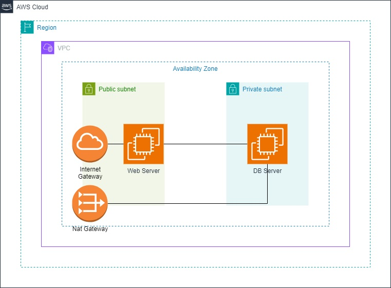

# Esercitazione IaaS su AWS (Single-AZ): WordPress (EC2 pubblica) + MariaDB (EC2 privata)

> **Scenario**: tutto **in una sola Availability Zone (AZ)** per ridurre complessità e costi.

> **Obiettivo**: distribuire un’app WordPress su **EC2 in subnet pubblica** e un database **MariaDB su EC2 in subnet privata** nella **stessa AZ**.

> **Esito atteso**: l’IP pubblico dell’istanza *app* mostra la pagina di setup di WordPress collegata al DB.

---

## 0) Requisiti & Note

* **Regione**: usa una (es. `eu-east-1`) e **una sola AZ** (es. `eu-east-1a`).

* **Nomenclatura**:
  
  * VPC: `vpc-wp-lab`
  * Subnet pubblica: `subnet-wp-lab-public-a` (p.es. `10.0.1.0/24`)
  * Subnet privata DB: `subnet-wp-lab-db-a` (p.es. `10.0.10.0/24`)
  * Route table pubblica: `rtb-public`
  * Route table privata: `rtb-private`
  * Internet Gateway: `igw-wp-lab`
  * NAT Gateway: `nat-wp-lab`
  * SG App: `sg-wp-app`
  * SG DB: `sg-wp-db`
  * EC2 App: `ec2-wp-app`
  * EC2 DB: `ec2-wp-db`
  * Key pair: `kp-wp-lab`
  * Tag: `Project=wp-lab`

---

## 1) Architettura (Single-AZ)



> **Nota**: Single-AZ = nessuna ridondanza di zona. È un setup didattico, non HA.

---

## 2) Rete (VPC, Subnet, Routing)

1. **VPC**
   
   * Console → **VPC** → *Your VPCs* → **Create VPC** → *VPC only*
   * Name: `vpc-wp-lab`, IPv4 CIDR: `10.0.0.0/16` → **Create**.

2. **Internet Gateway**
   
   * **Internet Gateways** → **Create internet gateway** → Name `igw-wp-lab` → **Create** 
   * **Internet Gateway** `igw-wp-lab` → **Attach to VPC** `vpc-wp-lab`.

3. **Subnets** (scegli **una sola AZ**, es. `eu-east-1a`)
   
   * **Subnets** → **Create subnet** (VPC: `vpc-wp-lab`)
     
     * `subnet-wp-lab-public-a` — AZ: `eu-east-1a`, CIDR `10.0.1.0/24`
     * `subnet-wp-lab-db-a` — AZ: `eu-east-1a`, CIDR `10.0.10.0/24`

4. **Route table pubblica**
   
   * **Route Tables** → **Create route table** → Name `rtb-wp-lab-public`, VPC `vpc-wp-lab` → **Create**.
   * Apri `rtb-wp-lab-public` → **Routes** → **Edit routes** → **Add route**: `0.0.0.0/0` → Target **Internet Gateway** `igw-wp-lab` → **Save**.
   * **Subnet associations** → **Edit** → associa `subnet-wp-lab-public-a`.

5. **NAT + route privata**
   
   * **Elastic IPs** → **Allocate Elastic IP** → **Allocate**.
   
   * **NAT Gateways** → **Create NAT gateway**
     
     * Subnet: `subnet-wp-lab-public-a`, Elastic IP: quello allocato, Name: `nat-wp-lab` → **Create**.
   
   * **Route Tables** → **Create route table** → Name `rtb-wp-lab-private`, VPC `vpc-wp-lab` → **Create**.
   
   * Apri `rtb-wp-lab-private` → **Routes** → **Edit routes** → **Add route**: `0.0.0.0/0` → Target **NAT Gateway** `nat-wp-lab` → **Save**.
   
   * **Subnet associations** → associa `subnet-wp-lab-db-a`.

---

## 3) Security Groups

1. **App** — `gs-wp-app` (per EC2 pubblica)
   
   * **EC2 → Security Groups → Create**
     
     * Inbound:
       
       * HTTP TCP 80 → `0.0.0.0/0`
       * (Opz.) HTTPS TCP 443 → `0.0.0.0/0`
       * SSH TCP 22 → **My IP** (il tuo IP)
     
     * Outbound: **All traffic** (default).

2. **DB** — `gs-wp-db` (per EC2 privata)
   
   * **Create**
     
     * Inbound:
       
       * MySQL/Aurora TCP 3306 → **Source: `gs-wp-app`** (seleziona SG come sorgente)
       * (Opz.) SSH TCP 22 → **Source: `gs-wp-app`** (amministrazione via jump dalla App)
     
     * Outbound: **All traffic** (default).

---

## 4) Key pair

* **EC2 → Key pairs → Create key pair**
  Name `kp-wp-lab`, Type **RSA**, formato `.pem` → salva con permessi corretti.

---

## 5) EC2 Database (MariaDB in subnet privata)

1. **Lancia istanza**
   
   * **EC2 → Launch instance**
     
     * Name: `ec2-wp-db`
     
     * AMI: **Amazon Linux 2023 (x86_64)**
     
     * Type: `t3.micro`
     
     * Key pair: `kp-wp-lab`
     
     * Network: VPC `vpc-wp-lab`, Subnet `subnet-wp-lab-db-a`, **Auto-assign public IP: Disable**
     
     * Security group: `gs-wp-db`
     
     * Storage: 20 GiB gp3
   
   * **Launch instance** → attendi **Running**.
   
   * Annota il **Private IPv4** del DB (es. `10.0.10.23`).

> Il DB si aggiorna via **NAT**; quando non serve più, rimuovi il NAT.

---

## 6) EC2 Applicazione (WordPress in subnet pubblica)

1. **Lancia istanza**
   
   * **EC2 → Launch instance**
     
     * Name: `ec2-wp-app`
     
     * AMI: **Amazon Linux 2023**
     
     * Type: `t3.micro`
     
     * Key pair: `kp-wp-lab`
     
     * Network: VPC `vpc-wp-lab`, Subnet `subnet-wp-lab-public-a`, **Public IP: Enable**
     
     * Security group: `gs-wp-app`
     
     * Storage: 20 GiB gp3
   
   * **Launch instance** → prendi **Public IPv4** della App.

---

## 7) Installazione Wordpress

- Reperire l'indirizzo IP dell'App

- Collegarsi in SSH utilizzando le chiavi generate precedentemente
  
  ```bash
  ssh -i kp-wp-lab.pem ec2-user@<Public-IP-ec2-wp-app>
  ```

- Installare Wordpress
  
  ```bash
  # Installazione HTTPD e PHP
  sudo su
  dnf -y update
  dnf -y install httpd php php-mysqlnd php-fpm php-json php-curl php-zip php-gd php-mbstring php-xml
  systemctl enable --now httpd
  # Verificare funzionamento HTTPD http://<Public-IP-ec2-wp-app>
  
  # Installazione Wordpress
  cd /tmp
  wget https://wordpress.org/latest.tar.gz
  tar -xzf latest.tar.gz
  
  rm -rf /var/www/html/*
  cp -r wordpress/* /var/www/html/
  chown -R apache:apache /var/www/html
  chmod -R 755 /var/www/html/
  systemctl restart httpd
  ```

---

## 8) Installazione MariaDB

- Reperire l'indirizzo IP dell'istanza DB

- Uscire dalla sessione SSH della App (se già connessi)

- Copiare la chiave privata sull'instanza App utilizzando SCP
  
  ```bash
  scp -i kp-wp-lab.pem kp-wp-lab.pem ec2-user@<Public-IP-ec2-wp-app>:/tmp
  ```

- Collegarsi in SSH alla App e fare jump all'istanza DB
  
  ```bash
  ssh -i kp-wp-lab.pem ec2-user@<Public-IP-ec2-wp-app>
  ssh -i /tmp/kp-wp-lab.pem ec2-user@<Private-IP-ec2-wp-db>
  ```

- Installare e configurare MariaDB
  
  ```bash
  # Installazione MariaDB
  sudo su
  dnf -y update
  dnf -y install mariadb105-server mariadb105
  systemctl enable --now mariadb
  
  # Configuraziaone iniziale MariaDB
  mysql_secure_installation
  mysql -u root –p
  
  # Creazione DB e utente per WordPress
  CREATE DATABASE IF NOT EXISTS wordpress;
  CREATE USER 'wpuser'@'10.0.1.%' IDENTIFIED BY '<password>';
  GRANT ALL PRIVILEGES ON wordpress.* TO 'wpuser'@'10.0.1.%'; 
  FLUSH PRIVILEGES;
  ```

---

## 9) Test

* Apri `http://<Public-IP-ec2-wp-app>/` e completa il setup di **WordPress**.

---

## 10) Pulizia (obbligatoria)

1. **DB**: Termina `ec2-wp-db`; elimina volumi orfani; elimina SG `gs-wp-db`.

2. **App**: Termina `ec2-wp-app`; elimina SG `gs-wp-app` quando non più referenziato.

3. **Rete**:
   
   * **Route `rtb-wp-lab-private`**: disassocia ed elimina.
   * **NAT Gateway `nat-wp-lab`**: **Delete** (importante, costo orario).
   * **Elastic IP** del NAT: **Release**.
   * **Route `rtb-wp-lab-public`**: disassocia/elimina.
   * **IGW**: detach → elimina.
   * **Subnets** `subnet-wp-lab-public-a`, `subnet-wp-lab-db-a` → elimina.
   * **VPC** `vpc-wp-lab` → elimina.

4. **Key pair**: elimina se non serve.

5. **Controllo finale**: **AWS Resource Explorer** → nessuna risorsa residua.
